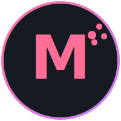

<!--
**RolfMoleman/RolfMoleman** is a ✨ _special_ ✨ repository because its `README.md` (this file) appears on your GitHub profile.
-->

  

  

## Hi there 👋 I'm known as Moleman

### About Me
- 🔭 I’m currently working on Standardised repository templates and terraform mdoules for common azure resources.
- 🌱 I’m currently learning typescript and CDK the hard way.
- 👯 I’m looking to collaborate on open source Terraform modules and Azure DevOps extensions.
- 🤔 I’m looking for help with building an [Azure DevOps extension for Ox Security Megalinter](https://github.com/DownAtTheBottomOfTheMoleHole/megalinter_ado_extension).
- 💬 Ask me about Terraform, Powershell and Azure
- 📫 How to reach me: please tag me in relevant discussions
- 😄 Pronouns: He/Him
- ⚡ Fun fact: I love cooking!

### My Skills
- **Languages:** Terraform, PowerShell, 
- **Frameworks:** 
- **Tools:** Git, Docker, Kubernetes

### Connect with Me
- [LinkedIn]([https://www.linkedin.com/in/your-profile](https://www.linkedin.com/in/carlrdawson/))

### GitHub Stats

---

  
    The banner, logo, and other creative assets in this repository are licensed under
    <a href="LICENSE">CC BY-NC-ND 4.0</a> © RolfMoleman (Carl Dawson).
    All rights reserved.
  

